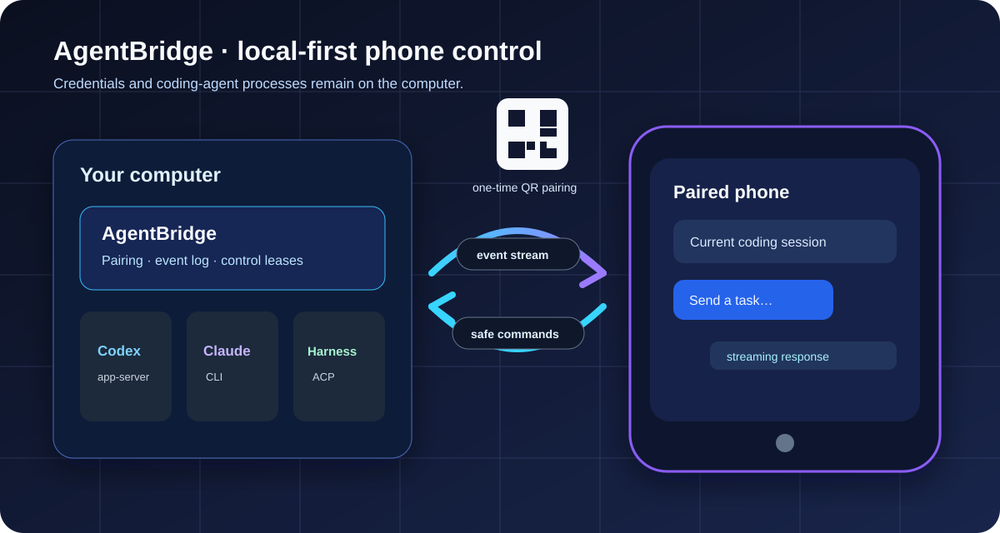
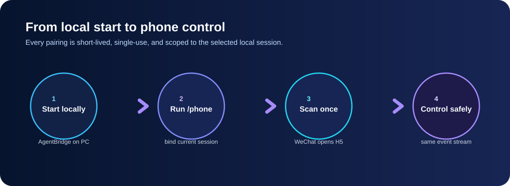

# AgentBridge MVP

[中文文档](./README.zh-CN.md) | [English](./README.md)
AgentBridge lets a phone opened from WeChat's scanner control coding agents running on this computer. The desktop and phone use the same append-only event stream, so messages, tool activity, approvals, and task state stay in sync.

This repository is a working local-first MVP. It includes:

- a one-time, two-minute QR pairing flow;
- a responsive mobile/desktop web console;
- HTTP commands plus resumable Server-Sent Events;
- project allowlisting, per-device sessions, command idempotency, and control leases;
- an Echo adapter for safe end-to-end testing;
- real OpenAI Codex App Server and Claude Code CLI adapters;
- a real DeepSeek Harness ACP adapter and a truthful ZCode native-remote handoff.
- a DSH Desktop `/phone` bundle that binds the exact open Desktop conversation.
## See how it works



The phone receives a short-lived QR pairing link, then sends commands and receives the same append-only event stream as the desktop. Provider credentials and child processes remain on the computer.



For the network and access boundaries, see the [security guide diagram](./docs/assets/security-boundaries.svg). A complete Chinese guide is available in [README.zh-CN.md](./README.zh-CN.md).

## Install `/phone` from a GitHub release

After this repository has been pushed to GitHub and tagged (for example `v0.1.0`), a Codex user with Node.js 22+ can install AgentBridge and its user-wide `/phone` skill in one terminal line:

```powershell
npm install --global github:<github-owner>/<repository>#v0.1.0; agentbridge setup codex
```

Replace the placeholders with the public GitHub owner and repository. The command installs the durable `agentbridge` CLI, then writes the Codex skill to the user's `.agents/skills/phone/SKILL.md`. Restart Codex after installation; `/phone` then starts AgentBridge when necessary and produces a one-time QR code for the current project.

For Bash or zsh, replace `;` with `&&`. A fixed tag is intentional: it makes the installed code reviewable and reproducible. See [`docs/RELEASING.md`](./docs/RELEASING.md) before creating the first release.

## Quick start

Requirements: Node.js 22 or newer. Codex, Claude Code, and DeepSeek Harness are optional; AgentBridge detects the supported local tools that are installed and authenticated on the computer.

```powershell
npm install
$env:AGENTBRIDGE_PROJECTS = "agentbridge=D:\codex_project\手机远程操控agent"
npm start
```

Open [http://127.0.0.1:8787](http://127.0.0.1:8787) on the computer. The desktop page creates its own local session and shows a one-time QR code. Keep the phone and computer on the same trusted LAN, open WeChat's **扫一扫**, and scan the code.

### Windows one-click start

Double-click `启动 AgentBridge.cmd` in the project root. It checks whether AgentBridge is already healthy, prevents a second copy from binding port 8787, starts the service in the background, writes logs under `.agentbridge/logs`, and opens the desktop page. If port 8787 is occupied by an unhealthy process, the window stays open and shows the conflicting process instead of starting another copy.

You may also create a normal Windows desktop shortcut pointing to this `.cmd` file. After AgentBridge is healthy, `/phone` in Claude Code or Codex can generate a QR code without keeping a terminal window open.

To create or refresh the desktop shortcut automatically, run:

```powershell
powershell.exe -NoProfile -ExecutionPolicy Bypass -File .\scripts\install-agentbridge-shortcut.ps1
```

This creates `AgentBridge.lnk` on the current user's desktop. The shortcut starts the same guarded launcher and opens the local dashboard.

### Tailscale one-click remote mode

Use this mode when the phone and computer are not on the same Wi-Fi. Install Tailscale on both devices, sign in to the same tailnet, and keep both devices connected. Then refresh the desktop shortcuts:

```powershell
powershell.exe -NoProfile -ExecutionPolicy Bypass -File .\scripts\install-agentbridge-shortcut.ps1
```

Double-click **AgentBridge Remote** on the Windows desktop, or run `启动 AgentBridge 远程模式.cmd` from this repository. The launcher:

1. checks that Tailscale is installed, signed in, and online;
2. reads this computer's stable `100.64.0.0/10` Tailscale IPv4 address;
3. safely restarts only a port-8787 process verified as this repository's AgentBridge;
4. listens on `0.0.0.0` while encoding `http://100.x.y.z:8787` into new `/phone` QR codes;
5. opens the local dashboard and keeps logs under `.agentbridge/logs`.

Now run `/phone` in the desired Codex, Claude Code, or DSH Desktop project conversation and scan the new QR. The phone may use cellular data or another Wi-Fi, but the Tailscale app must remain connected to the same tailnet. No router port forwarding or public IP is required.

This implementation deliberately uses the direct tailnet IP instead of Tailscale Serve or Funnel. AgentBridge's local setup endpoints distinguish loopback requests from remote requests; placing the current server behind a localhost reverse proxy would weaken that boundary. Funnel would also publish the service to the public Internet, which is outside this personal private-network mode.

If the shortcut reports that Tailscale is offline, open the Tailscale tray app and sign in. Useful checks are:

```powershell
tailscale status
tailscale ip -4
```

On some Windows installations, a normal user receives `Access is denied` from the Tailscale CLI even though its service is running. You then have two choices: run **AgentBridge Remote** as Administrator whenever needed, or, after reviewing the permission, run this once in an Administrator PowerShell:

```powershell
tailscale set --operator="$env:USERNAME"
```

The operator setting persistently allows that Windows account to control the local Tailscale service, so AgentBridge does not apply it silently. It does not grant access to other tailnets, but it is still a local privilege change and should be enabled only for your own trusted Windows account.


### ZeroTier one-click remote mode (works where Tailscale is unreliable)

ZeroTier is an alternative encrypted overlay network with the same security model as the Tailscale mode: the service stays inside the private virtual network, nothing is exposed to the public Internet, and AgentBridge's loopback-only setup endpoints remain unreachable from the phone path. It tends to be more reliable on networks where Tailscale's coordination servers are hard to reach, and it has official iOS and Android apps.

Setup, once:

1. Create a free account at [my.zerotier.com](https://my.zerotier.com) and create a network (keep **Private** access control). Copy its 16-hex-digit network ID.
2. Install **ZeroTier One** on this PC and join the network ID. Install the **ZeroTier** app on the phone and join the same network ID.
3. In my.zerotier.com → Members, tick **Auth** for both devices so they receive their managed IP addresses.

Then refresh the desktop shortcuts:

```powershell
powershell.exe -NoProfile -ExecutionPolicy Bypass -File .\scripts\install-agentbridge-shortcut.ps1
```

Double-click **AgentBridge Remote ZeroTier** on the Windows desktop, or run `启动 AgentBridge ZeroTier 远程模式.cmd` from this repository. The launcher mirrors the Tailscale mode — it verifies the ZeroTier adapter is up and has a managed IPv4 address (read via WMI, so no Administrator rights or CLI token are needed), safely restarts a verified AgentBridge on port 8787, listens on `0.0.0.0`, and encodes `http://<zerotier-ip>:8787` into new `/phone` QR codes.

The phone may use cellular data or any Wi-Fi; only the ZeroTier app must stay connected. If the phone cannot pair, allow Node.js through Windows Firewall when prompted (the ZeroTier adapter may be classified as a public network), and confirm the phone can open the shown `http://<zerotier-ip>:8787` address. Do not expose TCP 8787 through the router.

If ZeroTier's root servers are also unreliable for you, self-hosting a ZeroTier **moon** relay on a small VPS keeps the same mode working unchanged — both devices simply orbit the moon.

### Cloudflare Tunnel mode (no app on the phone at all)

Use this when VPN-style apps are unavailable on the phone (for example, ZeroTier/Tailscale are not in the Chinese App Store). `cloudflared` runs on the PC and publishes AgentBridge behind a free `https://<random>.trycloudflare.com` URL — the phone only needs a browser, on any network.

Install cloudflared once:

```powershell
winget install --id Cloudflare.cloudflared
```

Then double-click **AgentBridge Remote Cloudflare** on the Windows desktop (run `install-agentbridge-shortcut.ps1` first) or run `启动 AgentBridge Cloudflare 远程模式.cmd`. The launcher:

1. starts (or reuses a running) `cloudflared` quick tunnel and learns its assigned `trycloudflare.com` URL;
2. **forwards the tunnel to this PC's LAN IPv4 address, never `127.0.0.1`** — this keeps AgentBridge's loopback-only setup endpoints (pairing QR, `/api/bootstrap`, local sessions) unreachable through the public URL;
3. restarts a verified AgentBridge with the tunnel URL encoded into new `/phone` QR codes.

The quick-tunnel URL is public HTTPS but stays unguessable, and pairing still requires the one-time code displayed on the desktop. In this mode the launcher additionally enables a **shared access-key gate**: it generates a random key once (stored in `.agentbridge/access-key`, reused across restarts), embeds it in pairing and return QR codes, and every non-loopback request must carry it — a leaked URL alone is not enough to reach the pairing exchange. The key is printed in the launcher window for manual entry if a phone ever loses its cookie. The URL remains valid while the `cloudflared` process runs; rerun the launcher if it stops. If the LAN address changes (DHCP), restart the launcher so the tunnel target is refreshed.

Two more protections apply in every mode: paired-device sessions are persisted as SHA-256 digests in `.agentbridge/sessions.json`, so phones stay paired across bridge restarts; and the desktop page lists all paired devices under **已配对设备**, where any device (e.g. a lost phone) can be revoked with one click.

For a stable URL and an extra login gate, create a [named tunnel](https://developers.cloudflare.com/cloudflare-one/connections/connect-networks/) with your own domain and optionally put Cloudflare Access in front of it, then start with:

```powershell
powershell.exe -NoProfile -ExecutionPolicy Bypass -File .\scripts\start-agentbridge.ps1 -CloudflareTunnel -CloudflareNamedTunnel <name> -CloudflareOrigin https://bridge.example.com
```

Start with the Echo adapter. It verifies pairing, bidirectional commands, streaming, reconnect replay, and desktop/mobile synchronization without giving an AI tool access to files.

## Open the current project and conversation with `/phone`

Claude Code can expose the conversation that is already open in the current terminal. Install the local skill once:

```powershell
node .\bin\agentbridge.js install-claude-skill --user
```

Restart Claude Code so it discovers the skill. Then, from any project:

```text
cd D:\work\my-project
claude
> /phone
```

`/phone` passes Claude Code's official `${CLAUDE_SESSION_ID}` and the terminal's current directory to the loopback-only AgentBridge launcher. The CLI starts AgentBridge if necessary and prints a one-time QR code. Scanning it with WeChat opens that exact Bridge session, already selects it, and gives the phone the input lease. It does not guess the project from a message or inspect Claude's transcript.

The installed skill pre-approves only this exact AgentBridge launcher prefix through `allowed-tools`; it does not grant general Bash access. If Claude Code was already open while the skill was installed or upgraded, exit and reopen that Claude Code session before using `/phone`.

## Return to AgentBridge after closing WeChat

The QR emitted by `/phone` is intentionally short-lived and single-use. It is for first-time pairing only, so do **not** save that QR or its `/pair?code=...` URL.

After the first successful scan, AgentBridge displays a fixed return address in the phone UI. In WeChat, use the top-right `…` menu to **Favourite/收藏本页** (or copy the address). Reopening that favourite returns to the same Bridge and automatically selects the most recently used conversation for that paired phone. The desktop pairing strip also shows a separate “手机常用入口” QR; this QR contains only the fixed root address, never a pairing secret.

This shortcut works while AgentBridge is running and the WeChat site data/device session has not expired. If the cookie expires, WeChat site data is cleared, the Bridge is restarted, or a different phone scans the fixed QR, AgentBridge correctly asks for a fresh one-time scan instead of granting access.

Claude resumes the official session in a second CLI process. Keep the original Claude terminal idle while sending from the phone: Claude documents that concurrent processes writing to one session can interleave messages. AgentBridge prevents two paired phones from owning its input lease, but it cannot lock the original Claude terminal.

For Codex, Echo, or a known provider session ID, use the general CLI entry point:

```powershell
# Safe end-to-end test in the current directory
node .\bin\agentbridge.js phone --agent echo

# Start a new Codex conversation in the current directory
node .\bin\agentbridge.js phone --agent codex

# Attach a known, already-persisted Codex thread
node .\bin\agentbridge.js phone --agent codex --session <thread-id>
```

#### Codex Desktop `/phone`

Install the local Codex skill once:

```powershell
node .\bin\agentbridge.js install-codex-skill --user
```

Restart the Codex desktop project, then type `/phone` in a local-project conversation. The skill runs the loopback-only launcher with that project's current directory and prints a five-minute, single-use WeChat QR code. If Codex exposes a persisted thread ID to the invocation, use `--session <thread-id>` to attach exactly that conversation; the public skill interface does not expose an automatic current-thread ID substitution, so `/phone` without one creates a clearly labelled new Codex conversation in the same project. It never guesses the most recent desktop conversation.

After scanning, the phone page can select only models and reasoning efforts returned by the local Codex App Server for the signed-in account. The choice is applied to later phone turns in this AgentBridge session; it does not modify your global Codex settings or invent unavailable models.

You can optionally run `npm link` once and shorten these commands to `agentbridge phone ...`. The installed Codex skill is the convenient project-directory entry point; the CLI remains the reliable path when you already know the exact Codex thread ID to resume.

### Which model does it use?

Codex and Claude keep the provider conversation's own model configuration by default. For a Codex phone session, AgentBridge requests `model/list` from the local App Server and shows only that account's picker-visible models plus the supported reasoning strengths; a selected pair is sent as `model` and `effort` on later turns. Set `AGENTBRIDGE_CLAUDE_MODEL` before starting AgentBridge only when you need an explicit Claude Code model override. For Kimi Code, use an API model ID such as `kimi-for-coding`, not the display/version name `kimi-k2.7-code`. A Claude process that produces no structured output within 30 seconds is stopped with a visible error instead of leaving the phone page waiting indefinitely.

To expose more projects, set aliases before starting the server:

```powershell
$env:AGENTBRIDGE_PROJECTS = "web=D:\work\web-app;api=D:\work\api"
npm start
```

The phone sends only an alias such as `web`; the server resolves it to an allowlisted absolute path. It cannot submit an arbitrary working directory.

The `/phone` launcher is the only exception: it accepts an absolute current directory exclusively from a loopback connection on this computer, confirms that the path is an existing directory, canonicalizes it, and creates a temporary local alias. A phone request cannot use this endpoint or submit a path.

## Agent support

| Adapter | MVP status | Transport | Important behavior |
|---|---|---|---|
| Echo | Ready | In-process | Safe synchronization test |
| OpenAI Codex | Ready when installed | `codex app-server --stdio` | Streaming, cancel, and approval requests |
| Claude Code | Ready when installed | `claude -p --output-format stream-json` | Streaming, resume, and cancel; permission prompts are denied in this MVP |
| DeepSeek Harness | Ready when official dsh is installed | `dsh --profile acp` | Independent ACP sessions, committed-answer updates, cancel, and phone approval requests |
| DSH Desktop current conversation | Ready after local bundle install | Public slash command + live Agent/session events | `/phone` binds exact session ID, cwd, provider, and model; bidirectional same-session sync |
| ZCode | Official native handoff | ZCode Desktop Remote Control / Bot Channel | Bridge deliberately cannot create or attach ZCode sessions because ZCode has not published that local session API |

On Windows, the bridge resolves the installed Codex, Claude, or dsh package's native entry point. This preserves long-running stdio and avoids passing phone input through cmd.exe.

### DeepSeek Harness

Follow the official Harness quick-start and complete its local model and credential configuration. Before opening AgentBridge, make sure this command shows help instead of starting the browser UI:

~~~powershell
dsh --profile acp --help
~~~

Restart AgentBridge after installing dsh. The DeepSeek option changes from “未安装” to available only after the Bridge process can detect it. Creating a session starts one isolated official ACP connection for that project directory; it does not scrape the Harness web UI or select a model. The model and credentials remain the ones configured by Harness. Harness ACP publishes committed assistant answer blocks, so its display is accurate but not token-by-token or a mirror of its private Web UI tool timeline.

Use the current-directory launcher when appropriate:

~~~powershell
node .\bin\agentbridge.js phone --agent deepseek-harness
~~~

For a previously persisted Harness conversation, AgentBridge asks the current official ACP profile to resume the provider session ID. If the locally installed dsh version does not expose resume, the request fails visibly; it is never represented as a successful attach.

#### DSH Desktop: pair the conversation already on screen

Install the local profile bundle once, then restart DSH Desktop:

```powershell
npm run install:dsh-phone
```

Open a conversation from the desired project folder and enter:

```text
/phone
```

The command receives the live Agent object from DSH's public command runtime. It reads the authoritative `session.id`, `session.header.cwd`, `options.provider`, and `options.model`; it does not infer a folder, scrape the window, or create a second Harness conversation. The result contains a one-time QR image and pairing URL. Scan it in WeChat to open the H5 console already bound to that exact Desktop session.

Phone messages become normal DSH follow-up messages in the same live Agent. DSH's public `session/event` stream sends Desktop-entered messages, text deltas, completed replies, tools, and turn state back to AgentBridge. Re-running `/phone` rotates the private companion credential and issues a new five-minute, single-use QR.

#### Choose an already configured DSH Desktop model from the phone

After `/phone` has attached a DSH Desktop conversation, the phone console shows the current DSH provider/model and the model directory returned by that exact live DSH session. Choose a model and, when the provider exposes them, a reasoning effort, then tap **切换模型**. The request is accepted only when that phone owns the input lease and the current turn is idle. AgentBridge sends the selected entry through the private loopback companion; DSH Desktop's public `session.selectModel` validates and applies it, then returns the canonical selected model to the phone.

The selector never accepts a free-form model name and it does not inspect DSH Desktop's window or modify `app.asar`. If the current DSH build cannot return a model directory, the selector remains unavailable and the phone continues to control the conversation normally.

AgentBridge must already be running at `http://127.0.0.1:8787`. If a different local origin is needed, start DSH Desktop with `AGENTBRIDGE_ORIGIN` set to that loopback origin. To remove the integration:

```powershell
npm run uninstall:dsh-phone
```

Installation modifies only the user Desktop profile under `%USERPROFILE%\.dsh`; it stores a backup named `package.json.agentbridge-backup` and never patches `DSH Desktop.exe` or `app.asar`.

### ZCode

ZCode is not shown as createable. Its row is an explicit official handoff: use the ZCode desktop app's [Remote Control documentation](https://zcode.z.ai/en/docs/remote-control), or its [WeChat Bot Channel](https://zcode.z.ai/en/docs/bot-channel), to control an existing ZCode desktop workspace. This distinction prevents AgentBridge from claiming it can attach to a ZCode session when the vendor has not supplied a public local session protocol.

## Configuration

AgentBridge reads environment variables; [`.env.example`](./.env.example) documents all supported values.

| Variable | Default | Meaning |
|---|---|---|
| `AGENTBRIDGE_PORT` | `8787` | HTTP listen port |
| `AGENTBRIDGE_HOST` | `0.0.0.0` | Listen address |
| `AGENTBRIDGE_PROJECTS` | current directory as `workspace` | `alias=absolute-path` allowlist separated by semicolons |
| `AGENTBRIDGE_PUBLIC_ORIGIN` | first LAN IPv4 address | Address encoded into the QR code |
| `AGENTBRIDGE_MACHINE_NAME` | OS hostname | Name shown in the console |
| `AGENTBRIDGE_DATA_DIR` | `.agentbridge` | Append-only event storage |
| `AGENTBRIDGE_PAIRING_TTL_MS` | `300000` | One-time pairing-code lifetime (5 minutes) |
| `AGENTBRIDGE_SESSION_TTL_MS` | `259200000` | Device-session lifetime (72 hours) |
| `AGENTBRIDGE_CLAUDE_MODEL` | provider setting | Optional explicit Claude Code/Kimi API model ID used for phone turns |
| `AGENTBRIDGE_CLAUDE_FIRST_OUTPUT_TIMEOUT_MS` | `30000` | Fail a Claude turn when its process produces no structured output within this many milliseconds |

If the automatically selected LAN address is not reachable from the phone, set it explicitly:

```powershell
$env:AGENTBRIDGE_PUBLIC_ORIGIN = "http://192.168.0.2:8787"
npm start
```

Windows Firewall may ask whether Node.js can accept private-network connections. Permit only the **Private network** profile if the phone must connect directly.

## Security boundary

The QR contains a short-lived, single-use pairing code, not an Agent credential. Successful exchange creates an opaque device token stored in an `HttpOnly`, `SameSite=Strict` cookie. Raw tokens are not persisted; their SHA-256 digests are held by the bridge. Mutating requests require same-origin checks, command IDs prevent accidental replay, and only one device owns a session's input lease at a time. Stop is a two-click action in the UI.

This MVP uses plain HTTP and therefore is suitable only for a trusted LAN or the implemented private Tailscale tailnet mode. Do **not** forward port 8787 directly to the public Internet. A future public HTTPS relay would additionally require explicit proxy trust rules, multi-user authorization, device revocation, and a second pairing confirmation.

Agent credentials and child processes remain on the computer. The current MVP does not yet provide multi-user authorization, encrypted-at-rest event logs, recovery of live child processes after a bridge restart, or a cloud Relay.

## WeChat scope

The implemented path is **WeChat scan → mobile H5 → local AgentBridge**. It requires no Official Account and does not automate or hook a personal WeChat client.

A production Official Account or WeCom integration is a separate channel adapter: WeChat callbacks should be converted to the same command envelope and outbound Agent events should be rendered as template/customer-service messages. That work requires an account, callback domain, app credentials, user binding, and WeChat platform review, so it is intentionally not faked in this repository.

## API map

- `GET /api/bootstrap` and `GET /api/pairing/qr.svg`: loopback-only desktop pairing bootstrap.
- `GET /api/return-qr.svg`: loopback-only QR for the fixed, non-secret return address.
- `POST /api/pairings/exchange`: consume the one-time code and set a device cookie.
- `POST /api/recent-session`: record the calling device's last active Bridge session for safe root-address resume.
- `POST /api/local/phone`: loopback-only current-directory/session launcher used by the CLI.
- `POST /api/local/dsh-desktop/register`: loopback-only registration of the exact live DSH Agent from `/phone`.
- `GET /api/local/dsh-desktop/channels/:id/poll`: authenticated local companion command queue.
- `POST /api/local/dsh-desktop/channels/:id/events`: authenticated DSH event ingestion.
- `GET /api/state`: machines, adapters, projects, sessions, and event cursor.
- `GET /api/events?after=<seq>`: resumable SSE stream.
- `POST /api/sessions`: create an adapter session.
- `POST /api/sessions/:id/messages`: send an idempotent command.
- `POST /api/sessions/:id/control`: claim or explicitly take over input control.
- `POST /api/sessions/:id/stop`: interrupt the active turn.
- `POST /api/approvals/:id`: resolve a Codex approval request.

## Verification

```powershell
npm run check
npm test
```

The tests cover configuration, one-time and session-bound pairing, event persistence and cursors, project allowlisting, loopback current-directory registration, adapter attach/resume, DSH Desktop channel authentication and event mapping, idempotent plugin installation/removal, CLI skill generation, command idempotency, control leases, authenticated HTTP flows, and SSE replay.

## Design notes

The architecture and Happy project comparison are documented in:

- [`docs/architecture/wechat-multi-agent-remote-control.md`](./docs/architecture/wechat-multi-agent-remote-control.md)

Happy is useful mainly as validation of the local daemon + remote client + session streaming shape. AgentBridge deliberately adds a WeChat-friendly pairing/channel layer, a capability-driven multi-Agent adapter boundary, explicit control leases, and server-side project aliases instead of copying Happy wholesale.
