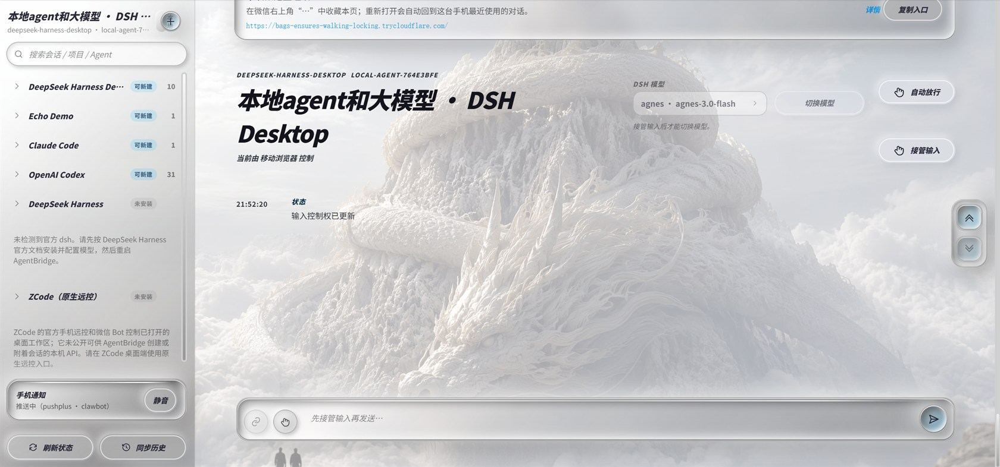
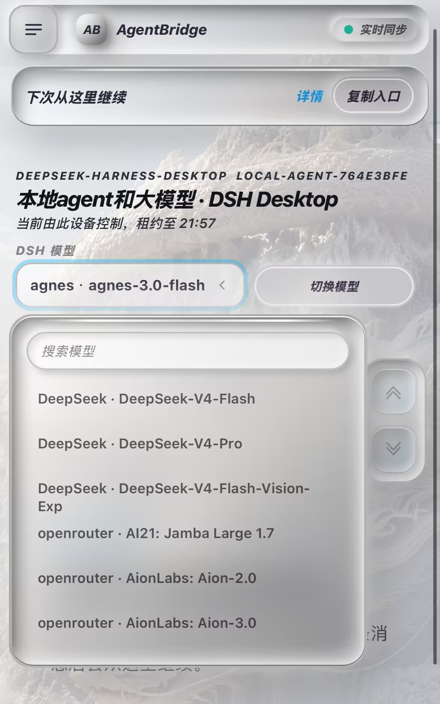
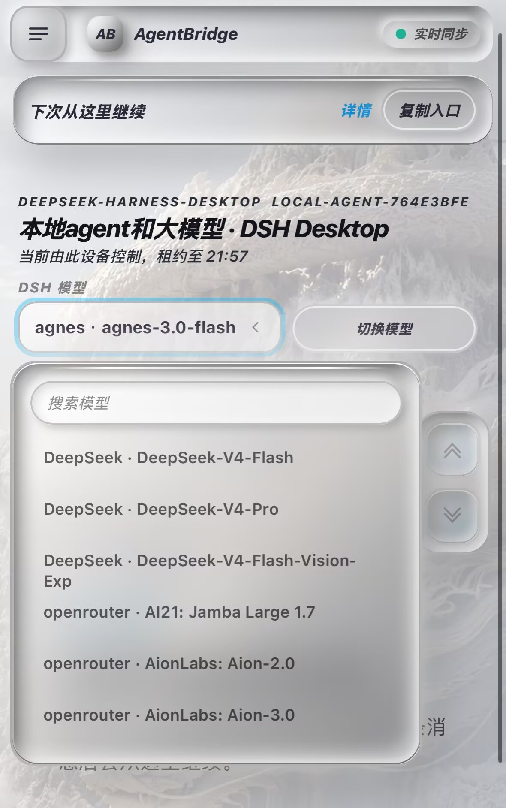

# AgentBridge

> 用微信扫一扫打开手机控制台，安全地查看、继续或停止这台电脑上正在运行的编程 Agent——不用把电脑暴露到公网，凭据始终留在本机。


手机与桌面共享同一份可追加事件流，因此消息、工具活动、审批和任务状态始终同步。电脑是唯一的执行端：手机只下发命令，不运行 Agent，也拿不到任何供应商凭据。

## 它是怎么工作的


1. **手机** 只负责界面与指令：扫码进入 H5 控制台，选工作区、选会话，发出消息、审批与停止命令。
2. **本地 Bridge** 是唯一枢纽：校验设备、维持会话与输入租约，把命令写进可追加事件流，再经 SSE 推回手机。
3. **电脑上的 Agent 子进程** 真正执行任务，凭据与文件访问始终留在本机，手机侧拿不到。

因为上行与下行共用同一条事件流，桌面端和手机看到的是同一份状态，而不是两套各自猜测的界面。

> 本文中标注为「分镜关键帧」的图片是讲解视频的概念示意图，用于说明结构关系；真实界面见下文「界面」一节。

## 主要能力

- **扫码配对**：一次性、5 分钟有效的二维码；配对后收藏固定回访地址，之后免扫码进入。
- **工作区 → 会话导航**：一个抽屉管理「Agent → 项目 → 会话」，Bridge 重启后历史与会话不丢失。
- **完整对话控制**：流式输出、停止、接管输入、翻看历史，表格 / 公式 / 代码块正确渲染。
- **远程协作**：审批卡片、提问卡片、限时自动放行（5/10/30 分钟）、消息排队、会话内搜索。
- **手机输入**：上传图片与文件、语音转文字、一键复制命令。
- **模型切换**：只使用 Agent 真实上报的模型目录，绝不编造模型名。
- **通知推送**：需要你处理时推送到企业微信 / Telegram / ServerChan / PushPlus。
- **多 Agent 统一接入**：Codex、Claude Code、DeepSeek Harness、DSH Desktop、ZCode（官方跳转）。

## 安装到你的电脑


### 前置条件

| 项 | 要求 |
|---|---|
| Node.js | **22 或更高**，`node -v` 确认 |
| 操作系统 | Windows（一键脚本齐全）；Linux / macOS 直接用 `npm start` |
| Agent 工具 | 可选，按需安装：Claude Code / Codex / DeepSeek Harness / DSH Desktop |

AgentBridge 不替你安装或登录任何 Agent，只检测本机**已安装且已登录**的那些；没装的显示「未安装」，不会假装可用。

### 四步装好

```powershell
# 1. 取代码（尚未发布到 npm，目前从仓库获取）
git clone https://github.com/chenacc1/agentbridge.git
cd agentbridge

# 2. 装依赖（运行时只有 katex 和 qrcode 两个）
npm install

# 3. 声明手机可以访问的项目目录：别名=绝对路径，分号分隔
$env:AGENTBRIDGE_PROJECTS = "agentbridge=D:\projects\agentbridge"

# 4. 启动
npm start
```

打开 [http://127.0.0.1:8787](http://127.0.0.1:8787)，桌面页会显示一次性二维码；手机连同一可信 Wi-Fi，用微信「扫一扫」扫描即可。

> 二维码只用于首次配对，会过期且**只能使用一次**。配对成功后请收藏手机页显示的固定回访地址，之后从收藏进入；不要收藏 `/pair?code=...` 临时链接。
> 第 3 步可以不写：不设 `AGENTBRIDGE_PROJECTS` 时默认把**启动目录**作为唯一可用项目，别名 `workspace`。别名只允许字母、数字、`_`、`-`（≤40 字符）。
> 这些变量必须设在**真正启动 Bridge 的那个终端**里；`.env.example` 只是一份清单，程序不会自动读取 `.env` 文件。

### 装完自检

```powershell
node .\bin\agentbridge.js phone --agent echo
```

Echo 适配器不接触任何 AI 工具，只验证「CLI → 本机 Bridge → 生成配对二维码」整条链路。能打印二维码就说明安装正确，扫码后可看到手机与桌面同步。

## 一键启动与停止（Windows）

| 入口 | 用途 |
|---|---|
| `启动 AgentBridge.cmd` | 局域网模式：检查服务健康、避免重复占用 8787、后台启动并打开控制台 |
| `启动 AgentBridge 远程模式.cmd` | Tailscale 模式，跨网络使用 |
| `启动 AgentBridge ZeroTier 远程模式.cmd` | ZeroTier 模式，Tailscale 不稳定时使用 |
| `启动 AgentBridge Cloudflare 远程模式.cmd` | Cloudflare Tunnel，手机不需装任何 App |
| `安全停止 AgentBridge.cmd` | 安全停止：不误杀其它进程、有任务在跑时拒绝停止、绝不强制 kill |

日志在 `.agentbridge/logs`；桌面快捷方式用 `.\scripts\install-agentbridge-shortcut.ps1` 创建或刷新。

## 远程接入方式

| 场景 | 模式 | 手机要求 |
|---|---|---|
| 同一可信 Wi-Fi | 局域网 | 浏览器 / 微信 |
| 跨网络，但属同一私有网络 | Tailscale | 同一 tailnet |
| Tailscale 不稳定 | ZeroTier | 同一私有网络 |
| 手机装不了 VPN 类 App | Cloudflare Tunnel | 只需浏览器 |


任何模式都不要把 TCP 8787 直接映射到公网。Cloudflare 模式额外启用访问密钥闸门（密钥存于 `.agentbridge/access-key`），光有二维码不够。

## 让 Agent 支持 `/phone`

`/phone` 不是 Agent 自带的功能，而是 AgentBridge 往对应客户端里装的一个**技能**（一个 `SKILL.md` 文件）。它只做一件事：在**当前项目目录**里调用 `agentbridge phone --agent <id>`，由 CLI 确保 Bridge 在运行、创建或附加会话、打印一次性二维码。

三个前提，每个 Agent 都一样：

1. Bridge 能在本机起来（上一步已自检）。
2. 目标 Agent 已安装并登录，且**在同一个项目目录里打开**。
3. 装完技能后**重启该客户端**，斜杠命令才会出现。

技能是纯文本文件，删掉对应的 `SKILL.md` 就等于卸载。

### Claude Code

```powershell
# 用户级（默认）：%USERPROFILE%\.claude\skills\phone\SKILL.md
node .\bin\agentbridge.js install-claude-skill --user

# 只装给某个项目：<项目>\.claude\skills\phone\SKILL.md
node .\bin\agentbridge.js install-claude-skill --project --cwd D:\projects\agentbridge
```

重启 Claude Code，在项目目录输入 `/phone`。技能用官方 `${CLAUDE_SESSION_ID}` 绑定**当前这段对话**，不读私有 transcript、不猜路径；只预授权 `agentbridge phone --agent claude …` 这一条命令，不授予通用 Bash 权限。

> 手机接管期间让原来的 Claude 终端保持空闲——Claude 官方说明多个进程写同一会话会交错消息。

### Codex Desktop

```powershell
# 用户级（默认）：%USERPROFILE%\.agents\skills\phone\SKILL.md
node .\bin\agentbridge.js install-codex-skill --user
```

重启 Codex 桌面项目，在本地项目会话输入 `/phone`。Codex 没对外提供「当前线程 ID」，所以不带参数时它会在同一项目目录**新建**一个会话并明确标注；只有你已知 thread ID 时才精确附加：

```powershell
node .\bin\agentbridge.js phone --agent codex --session <thread-id>
```

### DSH Desktop

前提：DSH Desktop 已安装，且存在桌面 profile `%USERPROFILE%\.dsh\profiles\desktop\package.json`（或由 `DSH_HOME` 指定）。

```powershell
npm run install:dsh-phone
```

这条命令只改 `%USERPROFILE%\.dsh`：把插件复制进 profile 的 `node_modules`、在 profile 的 `package.json` 里登记 `@agentbridge/dsh-phone` 并加入 `dsh.profile.bundles`，同时留一份 `package.json.agentbridge-backup`；**不会**改动 `DSH Desktop.exe` 或 `app.asar`。装完重启 DSH Desktop，在项目会话里输入 `/phone`。

这是唯一能**精确绑定屏幕上那条会话**的入口（会话 ID、目录、provider、模型都取自真实会话）。卸载：

```powershell
npm run uninstall:dsh-phone
```

### DeepSeek Harness（CLI / ACP）

前提：官方 `dsh` CLI 已安装并配置好模型与凭据，`dsh --profile acp --help` 能打印帮助（而不是弹出浏览器界面）。这个适配器没有斜杠技能，直接用 CLI：

```powershell
node .\bin\agentbridge.js phone --agent deepseek-harness
```

### 一张表汇总

| Agent | 前提 | 要执行的安装命令 | 重启客户端 | 入口 |
|---|---|---|---|---|
| Claude Code | 已安装并登录 | `install-claude-skill --user` | 需要 | `/phone` |
| Codex Desktop | 已安装并登录 | `install-codex-skill --user` | 需要 | `/phone` |
| DSH Desktop | 存在桌面 profile | `npm run install:dsh-phone` | 需要 | `/phone` |
| DeepSeek Harness | `dsh --profile acp --help` 可用 | 不需要 | — | `phone --agent deepseek-harness` |
| Echo | 无 | 不需要 | — | `phone --agent echo` |
| ZCode | 仅官方 Remote Control / Bot Channel | 不需要 | — | AgentBridge 不代管 |

### 通用说明

- `/phone` 只接受来自本机 loopback 的绝对路径，手机会话无法提交任意目录。
- 想让 `agentbridge` 成为全局命令，在仓库里跑一次 `npm link`。
- 仓库目前尚未创建 `v0.1.0` 标签；打上固定标签后，别人可用一行装好 CLI 与 Codex 技能：
  `npm install --global github:chenacc1/agentbridge#v0.1.0; agentbridge setup codex`

## 支持的 Agent

| 适配器 | 状态 | 说明 |
|---|---|---|
| Echo | 可用 | 进程内回声，安全验证扫码、同步与断线重连 |
| OpenAI Codex | 安装后可用 | `codex app-server --stdio`；流式、取消、审批、提问、历史发现 |
| Claude Code | 安装后可用 | `claude --print --input-format stream-json`；恢复、取消、审批与提问 |
| DeepSeek Harness | 安装官方 dsh 后可用 | `dsh --profile acp` 的独立 ACP 会话 |
| DSH Desktop | 安装本地 bundle 后可用 | 绑定屏幕上的会话，可双向同步、切换模型、新建会话 |
| ZCode | 官方原生交接 | 走 ZCode Desktop 的 Remote Control / Bot Channel，本身不伪造会话接口 |


每个适配器只承诺它真实支持的能力：缺哪项能力，界面就显示「未安装」或「仅桌面附着」，而不是摆一个按不动的按钮。

## 界面



手机端把同一份事件流重新排进窄屏：

| 手机端 ① | 手机端 ② |
|---|---|
|  |  |

## 常用配置

完整变量见 [`.env.example`](./.env.example)。

| 变量 | 默认值 | 含义 |
|---|---|---|
| `AGENTBRIDGE_PORT` | `8787` | HTTP 监听端口 |
| `AGENTBRIDGE_PROJECTS` | 当前目录 | 项目白名单，分号分隔 `别名=绝对路径` |
| `AGENTBRIDGE_PUBLIC_ORIGIN` | 第一个 LAN 地址 | 写入二维码的访问地址 |
| `AGENTBRIDGE_PAIRING_TTL_MS` | `300000` | 配对码有效期（5 分钟） |
| `AGENTBRIDGE_SESSION_TTL_MS` | `259200000` | 设备会话有效期（72 小时） |
| `AGENTBRIDGE_CLAUDE_MODEL` | 供应商默认 | 可选的 Claude / Kimi 模型 ID |
| `AGENTBRIDGE_NOTIFY_WEBHOOK` | 未设置 | 通知 Webhook；未设置时该功能静默 |

若自动选择的局域网地址手机访问不到，显式指定 `AGENTBRIDGE_PUBLIC_ORIGIN`；Windows 防火墙提示时只放行「专用网络」。

## 安全边界


- 二维码里是一次性配对码，不是 Agent 凭据；磁盘只保存设备 token 的 SHA-256 摘要。
- 设备 cookie 为 `HttpOnly` + `SameSite=Strict`；修改型请求校验同源，命令 ID 防重放，同一会话同时只有一台设备持有输入租约。
- Agent 凭据与子进程始终留在电脑上，手机永远不是执行环境。
- 当前不提供多用户授权、静态加密事件日志、重启后活动子进程恢复或云端 Relay。

## 验证

```powershell
npm run check           # 语法检查
npm test                # 单元与集成测试（当前 187 项全部通过）
npm run verify:mobile   # 可选：真实浏览器端到端，需要 Chrome 或 Edge
```

其余 `verify:*` 脚本（`navigation`、`models`、`scrim`、`notify`、`attach`、`features`、`blocks`、`questions`、`quicknav`）各自启动真实 Bridge 与无头浏览器做界面验证。

## 更多文档

- 架构说明：[`docs/architecture/wechat-multi-agent-remote-control.md`](./docs/architecture/wechat-multi-agent-remote-control.md)
- 功能与前端执行逻辑：[`docs/软件功能与前端执行逻辑.md`](./docs/软件功能与前端执行逻辑.md)
- 发布流程：[`docs/RELEASING.md`](./docs/RELEASING.md)
