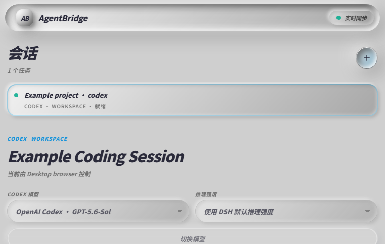
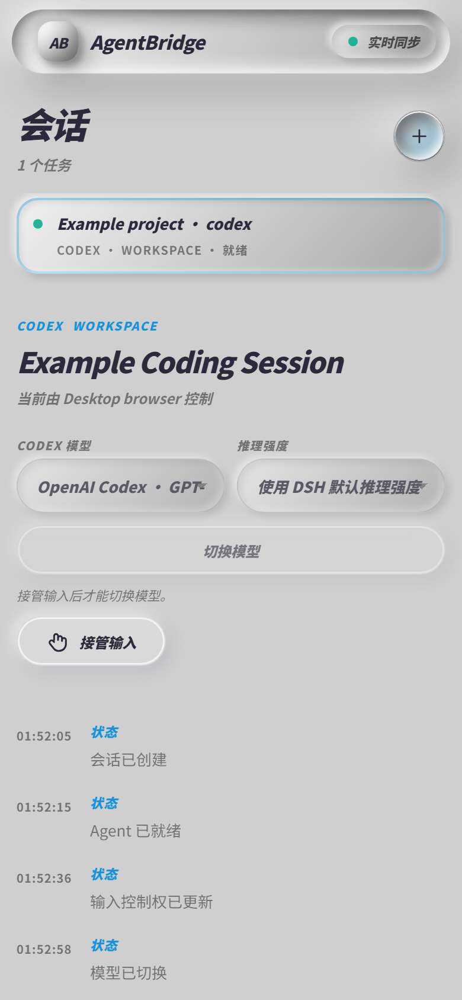
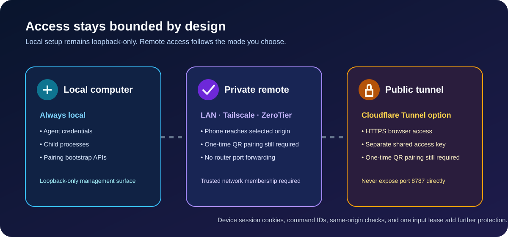

# AgentBridge MVP

[English](./README.md) | [中文文档](./README.zh-CN.md)

> 用微信扫一扫打开手机控制台，安全地操作此电脑上运行的 Codex、Claude Code、DeepSeek Harness 等编程 Agent。


AgentBridge 是一个可运行的、本地优先的 MVP：手机与桌面共享同一份可追加事件流，因此消息、工具活动、审批和任务状态会同步显示；凭据和子进程始终留在电脑上。

## 你能做什么

- 用一次性、短时有效的二维码将手机与本机配对；
- 在手机或桌面响应式控制台中查看会话、消息和任务状态；
- 通过 HTTP 命令与可断线续传的 SSE 事件流保持同步；
- 使用项目白名单、每设备会话、幂等命令与输入控制租约限制访问；
- 先用 Echo 适配器安全验证完整流程，再连接已安装的 Codex、Claude Code 或 DeepSeek Harness；
- 在支持的桌面会话中使用 `/phone`，将二维码精确绑定到当前项目和会话。

## 一分钟了解流程


1. 在电脑上启动 AgentBridge。
2. 在 Codex、Claude Code 或终端里执行 `/phone` / `agentbridge phone`。
3. 用微信的“扫一扫”扫描一次性二维码并完成配对。
4. 在手机浏览器控制已绑定的 Agent 会话；桌面和手机同步看到同一事件流。

二维码只用于首次配对，且会过期并且只能使用一次。配对成功后，请在微信中收藏手机页面显示的固定回访地址；不要收藏带有 `/pair?code=...` 的临时链接。
## 前端界面预览

### 桌面控制台



桌面端把当前 Agent 会话、模型选择、状态时间线和消息输入框放到同一工作区。配对二维码与已配对设备区域在公开截图中已移除，因为其中包含短时或设备专属信息。

### 手机控制台

<p align="center"></p>

手机端会针对窄屏重新排版同一会话。你可以接管输入控制权、在允许的范围内切换模型与推理强度、查看任务事件，并向 Agent 发送消息；凭据仍只保留在电脑上。

## 快速开始

**前提：** Node.js 22 或更高版本。Codex、Claude Code 和 DeepSeek Harness 均为可选工具；AgentBridge 会检测本机已安装且已登录的受支持工具。

```powershell
npm install
$env:AGENTBRIDGE_PROJECTS = "agentbridge=D:\codex_project\手机远程操控agent"
npm start
```

在电脑浏览器打开 [http://127.0.0.1:8787](http://127.0.0.1:8787)。桌面页会显示一次性二维码。让手机与电脑连接至受信任的同一局域网，在微信中打开“扫一扫”扫描二维码。

### Windows 一键启动

双击项目根目录的 `启动 AgentBridge.cmd`。脚本会检查现有服务、避免重复占用 8787 端口、在后台启动服务并打开桌面控制台。日志保存在 `.agentbridge/logs`。

如需创建或刷新桌面快捷方式：

```powershell
powershell.exe -NoProfile -ExecutionPolicy Bypass -File .\scripts\install-agentbridge-shortcut.ps1
```

## `/phone`：把当前项目和会话交给手机

### Codex Desktop

先安装用户级技能：

```powershell
node .\bin\agentbridge.js install-codex-skill --user
```

重启 Codex Desktop 的项目后，在本地项目会话中输入：

```text
/phone
```

技能会按当前项目目录启动本地 Bridge 并显示五分钟、单次有效的二维码。若你已经知道 Codex thread ID，可用 `--session <thread-id>` 精确附加；没有 thread ID 时，`/phone` 会在同一项目目录创建一个明确标注的新会话，而不会猜测“最近的对话”。

### Claude Code

先安装 Claude 技能：

```powershell
node .\bin\agentbridge.js install-claude-skill --user
```

重新启动 Claude Code，在目标项目目录里执行 `/phone`。技能使用官方 `${CLAUDE_SESSION_ID}` 与当前目录绑定会话，不读取私有 transcript，也不会猜测项目路径。

### 通用命令行

```powershell
# 无风险地验证完整链路
node .\bin\agentbridge.js phone --agent echo

# 在当前目录新建 Codex 会话
node .\bin\agentbridge.js phone --agent codex

# 附加已知的 Codex 会话
node .\bin\agentbridge.js phone --agent codex --session <thread-id>
```

目前仓库尚未创建 `v0.1.0` 标签。创建固定版本标签后，其他 Codex 用户可用如下单行命令安装 CLI 与 `/phone` 技能：

```powershell
npm install --global github:chenacc1/agentbridge#v0.1.0; agentbridge setup codex
```

固定标签可让安装内容可审查、可复现；不要让使用者直接从不固定的分支安装。

## 远程访问方式

| 场景 | 推荐模式 | 手机要求 | 说明 |
|---|---|---|---|
| 电脑和手机在同一可信 Wi-Fi | 局域网 | 浏览器/微信 | 最简单；不需要公网端口映射 |
| 不同网络，但设备属于同一私人网络 | Tailscale | 同一 tailnet | 使用私有 `100.x.x.x` 地址，不公开端口 |
| Tailscale 在网络中不稳定 | ZeroTier | 同一私有网络 | 与 Tailscale 相同的私有覆盖网络思路 |
| 手机不能安装 VPN 类 App | Cloudflare Tunnel | 浏览器 | 临时 HTTPS 地址配合一次性二维码和访问密钥 |



无论选择哪种远程方式，都不要把 TCP 8787 直接映射到公网。Tailscale/ZeroTier 适合私有网络；Cloudflare Tunnel 的临时地址仍需要一次性配对和访问密钥，生产级公开部署还需要额外的身份认证与授权设计。

## Agent 支持情况

| 适配器 | 状态 | 关键行为 |
|---|---|---|
| Echo | 可用 | 不访问 AI 工具，适合验证扫码、同步、断线重连与控制权 |
| OpenAI Codex | 安装后可用 | `codex app-server --stdio`；支持流式输出、取消和审批 |
| Claude Code | 安装后可用 | `claude -p --output-format stream-json`；支持恢复与取消 |
| DeepSeek Harness | 安装官方 dsh 后可用 | `dsh --profile acp` 的独立 ACP 会话 |
| DSH Desktop 当前会话 | 安装本地 bundle 后可用 | `/phone` 精确绑定会话 ID、目录、供应商和模型 |
| ZCode | 官方原生交接 | 请使用 ZCode Desktop Remote Control 或 WeChat Bot Channel |

Codex 手机会话只能选择本地 Codex App Server 返回的可用模型和推理档位；选择仅影响这个 AgentBridge 会话后续的手机回合，不会修改全局 Codex 设置。

## 安全边界

二维码携带的是短时、单次的配对码，不是 Agent 凭据。兑换成功后会在手机上设置 `HttpOnly`、`SameSite=Strict` 的设备 cookie；磁盘中只保存 token 的 SHA-256 摘要。修改型请求需要同源检查，命令 ID 防止重放，每个会话同时只能有一台设备持有输入控制权。

Agent 凭据和子进程留在电脑上。本项目目前不提供多用户授权、静态加密事件日志、Bridge 重启后的活动子进程恢复或云 Relay。微信部分是“微信扫码 → 手机 H5 → 本地 AgentBridge”，不需要公众号，也不会 Hook 或自动化个人微信客户端。

## 常用配置

完整变量请见 [`.env.example`](./.env.example)。

| 变量 | 默认值 | 含义 |
|---|---|---|
| `AGENTBRIDGE_PORT` | `8787` | HTTP 监听端口 |
| `AGENTBRIDGE_HOST` | `0.0.0.0` | 监听地址 |
| `AGENTBRIDGE_PROJECTS` | 当前目录作为 `workspace` | 项目别名与绝对路径的白名单 |
| `AGENTBRIDGE_PUBLIC_ORIGIN` | 第一个 LAN IPv4 | 写入二维码的访问地址 |
| `AGENTBRIDGE_PAIRING_TTL_MS` | `300000` | 配对码有效期，默认 5 分钟 |
| `AGENTBRIDGE_SESSION_TTL_MS` | `259200000` | 设备会话有效期，默认 72 小时 |
| `AGENTBRIDGE_CLAUDE_MODEL` | 供应商默认值 | 可选的 Claude/Kimi API 模型 ID |

例如，若自动选择的局域网地址无法被手机访问：

```powershell
$env:AGENTBRIDGE_PUBLIC_ORIGIN = "http://192.168.0.2:8787"
npm start
```

Windows 防火墙要求授权 Node.js 时，只允许“专用网络”即可；不要为路由器创建端口转发规则。

## 验证与更多资料

```powershell
npm run check
npm test
```

- 英文完整技术参考：[README.md](./README.md)
- 发布步骤：[docs/RELEASING.md](./docs/RELEASING.md)
- 架构与 Happy 对比：[docs/architecture/wechat-multi-agent-remote-control.md](./docs/architecture/wechat-multi-agent-remote-control.md)

欢迎提交 Issue 或 PR。提交前请不要包含 `node_modules`、`.agentbridge` 缓存、令牌、日志以及内部工作笔记。