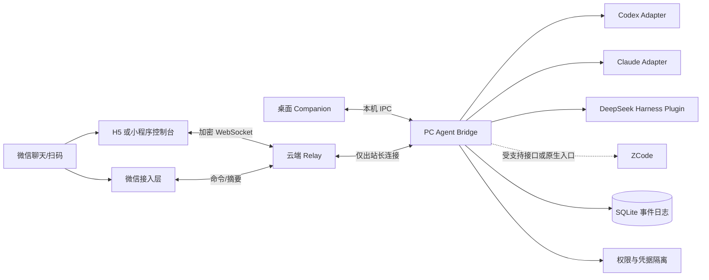

# 微信统一操控多种桌面 Agent：技术方案

> 状态：架构建议稿  
> 日期：2026-09-08  
> 暂用产品名：AgentBridge

## 1. 结论

这个产品可行，但应把目标定义成：

1. 电脑上的 Agent Runtime 是唯一执行端；手机只负责查看、输入、审批、停止和切换会话。
2. 所有 Agent 先接入本机 Bridge，再由桌面界面与手机共同订阅同一条规范化事件流。
3. 微信承担“身份入口、扫码、通知和轻量命令”；完整流式对话、diff、日志和审批放在微信内打开的 H5/小程序控制台。
4. 不接管个人微信客户端，不做 PC 微信注入、Hook、模拟点击或非官方个人号机器人。
5. 第一版优先接 Claude Code 和 Codex；DeepSeek Harness 通过插件接入；ZCode 先利用其现成的 Remote Control/Bot Channel，待有稳定公开接口后再统一到一个入口。

这里最难的不是“从微信发一句文字”，而是四件事：不同 Agent 的会话协议、审批语义、断线重放，以及如何让手机和电脑不会同时成为冲突的写入者。

## 2. 先明确两组容易混淆的需求

### 2.1 “微信扫码操控”可能表示两种产品

| 方式 | 用户体验 | 安全与能力 | 建议 |
|---|---|---|---|
| 微信扫二维码，打开 H5/小程序 | 仍在微信里使用，但界面由我们提供 | 可做流式更新、按钮审批、diff、文件与端到端加密 | 主入口 |
| 直接在微信聊天窗口给 Bot 发消息 | 最像聊天机器人 | 平台和 Bot 网关能看到消息；富交互、流式更新和长日志受限 | 辅助入口 |

如果要求“个人微信里出现一个普通好友，任意收发消息”，目前没有适合生产使用的公开通用接口。合规产品应选公众号、企业微信应用/客服能力，或让微信扫码打开控制台。

### 2.2 “与电脑界面同步”也有两个等级

| 同步等级 | 是否可行 | 说明 |
|---|---|---|
| 我们的桌面 Companion 与手机显示同一会话 | 可完全实现 | 两端消费同一事件日志 |
| 任意已打开、未经改造的厂商 GUI/TUI 都被实时注入并逐字同步 | 不能统一保证 | 取决于厂商是否提供可附着的会话协议；禁止用 UI 抓取冒充可靠集成 |

因此，“完全同步”的工程定义应是：Bridge 管理的会话在桌面 Companion、网页/小程序和微信 Bot 摘要中一致。对于厂商原生界面，只在存在官方 SDK、App Server 或插件事件总线时承诺一致性。

## 3. 推荐总体架构



### 3.1 PC Agent Bridge

每台电脑只运行一个后台服务，职责包括：

- 发现并启动 Agent，但不能扫描整台机器的任意目录；项目必须进入 allowlist。
- 把各家消息、工具调用、文件改动、审批请求映射为统一事件。
- 保存本机权威事件日志、会话映射和断线游标。
- 维护“当前输入控制权”；桌面与手机均可读，但同一时刻只有一个写入租约。
- 处理高风险动作的本地确认、超时和撤销。
- 使用 Windows Credential Manager/macOS Keychain/libsecret 保存供应商凭据；凭据不上传 Relay。
- 只主动连接云端 Relay，不在公网暴露本机端口。

### 3.2 云端 Relay

Relay 不是远程 shell，建议只提供：

- 设备注册、吊销和短时扫码配对。
- WebSocket/SSE 路由、游标续传、推送通知。
- 加密事件 blob 的短期缓存与可选持久化。
- 幂等键、序列号和在线状态。
- 微信平台回调适配。

Relay 不应持有 Agent API Key，也不应拥有可直接调用 `bash/readFile/writeFile` 的永久通用权限。远程操作必须是带会话、项目、动作类型和期限的细粒度 capability。

### 3.3 桌面 Companion

桌面端不是另一个执行器，而是 Bridge 的可视化客户端：

- 会话列表、实时对话、工具步骤、diff、终端摘要。
- 展示手机在线、谁持有输入控制权、最近命令来源。
- 明确的“停止远控”“吊销设备”“仅查看模式”。
- 高风险命令可要求电脑端二次确认。

第一版可用 Tauri + React；如果团队全栈偏 TypeScript，Electron 也可接受。Bridge 建议 Node.js/TypeScript，因为 Claude 与 Codex 的官方 SDK/协议最容易直接接入，Windows PTY 兼容也更成熟。

## 4. Agent 适配层

统一接口不要追求覆盖各家全部细节，而应声明能力：

```ts
interface AgentAdapter {
  detect(): Promise<Detection>;
  capabilities(): AgentCapabilities;
  start(input: StartSessionInput): Promise<SessionRef>;
  resume(ref: SessionRef): Promise<void>;
  send(ref: SessionRef, input: UserInput): Promise<void>;
  cancelTurn(ref: SessionRef): Promise<void>;
  resolveApproval(ref: SessionRef, decision: ApprovalDecision): Promise<void>;
  snapshot(ref: SessionRef): Promise<SessionSnapshot>;
  events(ref: SessionRef, afterSeq?: number): AsyncIterable<AgentEvent>;
}
```

能力由 `supportsResume`、`supportsTokenDelta`、`supportsToolEvents`、`supportsApproval`、`supportsAttach`、`supportsFork` 等字段表达；手机 UI 只显示适配器真实支持的按钮。

### 4.1 各 Agent 的现实接入策略

| Agent | 首选接法 | 同步质量 | 关键边界 |
|---|---|---:|---|
| OpenAI Codex | 本机启动 `codex app-server`，用 stdio JSONL/JSON-RPC 连接 | 高 | app-server正是给富客户端提供认证、历史、审批和流式事件；网络 WebSocket仍标为实验性，因此 Bridge 内部优先 stdio，不直接暴露公网 |
| Claude Code | Claude Agent SDK 的双向/流式输入输出、会话恢复和审批接口 | 高 | 由 Bridge 启动和拥有会话；不要尝试劫持任意既有 TUI |
| DeepSeek Harness | 编写 Cordis 插件，订阅 append-only session log/event services，并注册受限控制服务 | 高（需版本固定） | 当前仍是 developer preview，插件 API 会变化；用契约测试锁版本 |
| ZCode | 短期直接用官方 Remote Control/Bot Channel；统一平台只做入口跳转或状态聚合 | 原生功能高，统一接入未知 | 已有微信扫码/机器人能力；在未确认公开会话 SDK 前，不解析内部文件、不注入 GUI |
| 其他 CLI Agent | PTY 子进程 + 结构化输出（如厂商提供） | 中/低 | 纯 ANSI 屏幕抓取只能作为兼容模式，不承诺结构化审批、可靠恢复或完全同步 |

Codex 官方文档说明 App Server 支持 thread/turn/item、双向 JSON-RPC、审批和增量通知；Claude 官方 Agent SDK 可流式获取文本与工具调用。[Codex App Server][codex-app-server] [Claude streaming][claude-streaming]

DeepSeek Harness 官方将模型、工具、会话、存储、循环与 UI 都定义为可替换插件，并以 append-only session log 支持恢复、分叉、搜索和重放，适合把 Bridge 做成插件，而不是屏幕代理。[DeepSeek Harness][deepseek-harness]

ZCode 官方已经支持手机扫码 Remote Control，以及微信 Bot Channel，并明确手机只是控制面、命令仍在桌面已连接的环境执行。[ZCode Remote Control][zcode-remote] [ZCode Bot Channel][zcode-bot]

## 5. 统一事件协议

### 5.1 事件包

```json
{
  "v": 1,
  "eventId": "evt_...",
  "machineId": "m_...",
  "sessionId": "s_...",
  "turnId": "t_...",
  "seq": 1842,
  "time": "2026-09-08T10:00:00.000Z",
  "kind": "approval.requested",
  "actor": { "type": "agent", "adapter": "codex" },
  "payload": {},
  "prevHash": "..."
}
```

核心事件最少包含：

- `session.created | resumed | status_changed | closed`
- `turn.started | cancelled | completed | failed`
- `message.started | delta | completed`
- `tool.started | output_delta | completed | failed`
- `file.changed | diff.available`
- `approval.requested | resolved | expired`
- `control.requested | granted | released | revoked`

所有改变状态的命令都带 `commandId`、`idempotencyKey`、`expectedRevision` 和 `expiresAt`。服务端重复收到微信回调或客户端重试时，不能重复执行。

### 5.2 断线恢复

1. Bridge 先把规范化事件写入 SQLite，再发送到 Relay。
2. Relay 为每个会话分配单调递增 `seq`；客户端确认最后消费的 `seq`。
3. 重连发送 `resume(afterSeq)`，缺口较小就补增量，缺口过大则返回 snapshot + tail。
4. `message.delta` 可丢弃并用最终 `message.completed` 修复；审批、工具完成、文件修改等状态事件不可丢。
5. 微信平台回调按平台消息 ID 去重，并立即返回成功；耗时 Agent 操作异步执行。

### 5.3 控制权

桌面与手机始终可同时观看，但输入使用租约：

- 默认桌面持有写租约。
- 手机点击“接管”后获得有限期 lease；桌面明显提示。
- 桌面任意输入可请求收回，但正在等待的审批先明确解决或过期。
- 同一 revision 只接受一个审批决定；后到请求返回“已处理”。
- 多个手机设备不能隐式抢占，必须展示设备名并显式确认。

这比简单的“最后写入者获胜”更安全，也避免手机和电脑同时给 Agent 发两条互相冲突的指令。

## 6. 微信接入设计

### 6.1 推荐组合

**个人/小团队版：** 微信扫描普通 HTTPS 二维码 → H5 控制台；公众号只发送“任务完成/需要审批”的摘要通知。

**企业版：** 企业微信自建应用接收成员消息和事件，卡片链接打开 H5；成员身份映射到组织账户与项目权限。

**对外用户版：** 认证服务号或小程序。聊天只接受短命令，复杂操作进入小程序；是否能主动触达及消息类型必须按账号实际权限和微信当期规则做能力探测。

微信公众号可通过服务器 URL 接收用户普通消息，带参数二维码可把场景值随扫码事件传给服务器；企业微信自建应用支持加密回调并可异步发送应用消息。[公众号接收消息][wechat-receive] [公众号带参二维码][wechat-qr] [企业微信接收消息][wecom-receive] [企业微信发送应用消息][wecom-send]

### 6.2 聊天命令

自然语言负责创建任务与补充说明；状态改变使用明确命令或按钮：

```text
/machines
/agents
/new codex <project-alias>
/use <session-short-id>
/status
/stop
/takeover
/approve <request-short-id>
/deny <request-short-id>
/disconnect
```

不要把单独的“好”“继续”“可以”自动解释为 shell 或文件修改审批。审批消息应包含：Agent、机器、项目、动作、关键参数、风险等级、过期时间以及“仅本次/本会话”的范围。

### 6.3 为什么复杂交互必须进入 H5/小程序

- 微信聊天不适合高频 token delta；应该节流成 1–2 秒摘要或只发最终消息。
- diff、工具树、长日志、文件附件和审批按钮需要结构化 UI。
- 直接聊天经过微信和 Bot 网关，不能声称消息内容对 Relay 端到端不可见。
- H5/小程序可在应用层由手机端加密到 PC Bridge，Relay 只转发密文。

## 7. 扫码配对与密钥

推荐一次性配对流程：

1. Bridge 生成 `pairingId`、一次性 X25519 公钥、随机 nonce 和 2 分钟有效期。
2. Relay 只保存 pairing 状态和公钥；二维码只放 HTTPS URL/小程序 scene 与不透明 `pairingId`，不放长期 bearer token。
3. 用户用微信扫码，通过微信 OAuth/小程序登录得到平台身份，再看到电脑名、项目范围和申请权限。
4. 手机与 Bridge 显示同一个 6 位短认证串；至少一端需要显式确认，防止截图转发或中间人替换二维码。
5. 双方完成密钥协商，为手机签发设备证书；每个会话数据密钥分别密封给已授权设备。
6. Relay 保存设备公钥、吊销状态和密文；供应商 token 始终只在电脑本地。
7. 用户在电脑端可立即吊销单个设备或停止全部远控；吊销后轮换会话密钥。

加密建议使用经过审计的库完成 X25519 + HKDF + XChaCha20-Poly1305（或平台成熟的 AES-256-GCM），不要自造密码协议。日志需要把命令内容与审计元数据分开：内容可 E2EE，审计仅保留谁在何时对哪个会话执行何种动作及结果。

## 8. 安全基线

- 默认只能访问配置过的项目 alias，不接受手机传任意绝对路径。
- 默认禁止管理员 shell、注册表、系统服务、凭据目录、SSH/GPG 私钥目录。
- `read`、`write`、`shell`、`network`、`git push`、`deploy` 分开授权。
- 删除、覆盖、发布、支付、账号权限等高风险动作要求二次确认；确认必须绑定命令摘要，不能被后续参数替换。
- Agent 输出、网页内容、仓库文件都视为不可信；它们不能自行生成有效审批。
- Bridge 子进程使用低权限用户，优先在容器/WSL/沙箱执行。
- Relay 与 Bridge 之间使用 TLS；应用层再加密会话内容。
- push 通知不放源码、命令参数或密钥，只放“某任务需要审批”。
- 全链路限速、设备级熔断、重放保护、异常登录提醒和一键 kill switch。
- 针对供应链锁定 SDK/CLI 版本并验证签名或哈希；适配器升级先跑录制回放测试。

## 9. 对 Happy 的借鉴方式

Happy 对这个项目有很强的借鉴意义，但应借鉴架构模式，不直接把它改成微信 Bot。

配套的源码级分析见 [Happy 项目参考分析](../research/happy-reference-analysis.md)。

值得复用的模式：

- 本机 wrapper/daemon 持有真实 Agent，手机只做控制面。
- HTTP 做查询与动作，实时通道做事件同步。
- 本地生成密钥、扫码绑定设备、Relay 保存和转发加密 blob。
- 本地/远程控制切换、权限请求上送手机、断线重连和乐观并发。
- 会话协议把消息、工具调用、生命周期和文件作为事件，而不是同步终端屏幕。

需要重新设计的部分：

- 从 Claude/Codex 专用 envelope 升级为 capability-driven 的多 Agent 协议。
- 微信聊天入口与 E2EE 控制台是两条不同安全路径。
- Relay 不能得到供应商 API token；也不应默认拥有通用 shell/文件 RPC。
- 明确输入租约、幂等审批和离线重放。
- Windows 为一等平台，先验证进程树清理、PTY、休眠恢复和 Credential Manager。

Happy 当前仓库包含移动/Web 客户端、CLI/Agent、Server 和桌面端，并公开了协议、实时同步、加密、后端、CLI 和会话协议文档；它采用 MIT 许可证，可在保留许可证与版权声明的前提下复用代码。[Happy repository][happy-repo] [Happy internal docs][happy-docs]

不要仅凭“E2EE”宣传语判断所有数据的边界。实现时应逐项列出：对话、文件、设备元数据、推送内容、Agent token、OAuth token分别在哪里加密、谁持有解密钥匙。

## 10. MVP 路线

### Phase 0：协议尖峰（3–5 天）

- 用 Codex App Server 跑通新建/续接 thread、流式 item、审批与取消。
- 用 Claude Agent SDK 跑通流式消息、工具事件、审批与恢复。
- 用一个本机网页同时观看两个会话。
- 证明断线后按 seq 不重不漏。

验收：两个适配器各完成 20 次录制回放；重连后最终 transcript、工具状态和审批状态完全一致。

### Phase 1：本地 MVP（2 周）

- Bridge + SQLite + H5 控制台。
- HTTPS 二维码扫码配对。
- 项目 allowlist、查看/输入/停止/审批。
- 桌面托盘、远控状态和 kill switch。

验收：手机不在局域网时可安全访问；Relay 断开不影响本机任务；恢复网络后补齐事件；未授权路径无法打开。

### Phase 2：微信渠道（1–2 周）

- 先接企业微信自建应用或已认证公众号二选一。
- 完成 callback 签名校验、解密、去重、异步执行、摘要回复。
- 任务完成/审批通知链接到 H5。

验收：重复回调只执行一次；消息平台超时不会中断 Agent；Bot 无权限时不泄露机器、项目或 session 信息。

### Phase 3：生产安全（2–4 周）

- 端到端会话加密、设备吊销和密钥轮换。
- 分级审批、审计、限速、异常检测、灾难恢复。
- Windows 休眠/重启/进程崩溃恢复。
- 渗透测试和 prompt-injection/重放/权限提升测试。

### Phase 4：扩展 Agent

- DeepSeek Harness 插件与版本契约测试。
- 评估 ZCode 是否提供受支持的统一接口；没有则保留原生 Bot 入口。
- 发布 Adapter SDK，让新适配器先声明能力再注册事件映射。

## 11. 最小部署拓扑

开发期可用三进程：

```text
PC: agentbridge + sqlite + codex/claude child processes
Cloud: relay-api + websocket + postgres/redis（早期可先不持久化内容）
Mobile: responsive H5 opened from WeChat QR
```

生产期推荐：Relay API 无状态化，Redis Streams/NATS JetStream 做短期事件路由，PostgreSQL 存账户/设备/游标/审计元数据，对话内容只存密文。首版不要上 Kafka、Kubernetes 或自研消息数据库。

## 12. 建议的首版成功指标

- 手机到 Bridge 的命令确认 p95 小于 1 秒（不含模型生成时间）。
- 断网 10 分钟后恢复，最终状态一致且零重复执行。
- 一个审批请求最多生效一次，且 100% 绑定具体动作摘要。
- Relay 数据库泄露时无法得到项目源码、对话正文和供应商 token。
- 停止远控或吊销设备后 5 秒内失去新命令权限。
- Bridge 只能访问 allowlist 项目和已声明 capability。
- Codex/Claude 各连续运行 8 小时、100 轮任务无孤儿子进程。

## 13. 尚需产品确认的三个选择

1. 微信入口优先是“个人微信关注服务号”，还是团队内部“企业微信自建应用”？两者注册、审核和消息权限不同。
2. “电脑界面同步”是否接受我们提供统一桌面 Companion？如果必须同步厂商原生 GUI，Agent 覆盖面会明显缩小。
3. ZCode 指的是 `zcode.z.ai` 的 ZCode Agent。若是另一个同名产品，需要重新确认其集成接口。

这三个答案不会改变核心架构，但会改变第一版范围和上线时间。

## 参考资料

[happy-repo]: https://github.com/slopus/happy
[happy-docs]: https://github.com/slopus/happy/blob/main/docs/README.md
[codex-app-server]: https://developers.openai.com/codex/app-server
[claude-streaming]: https://code.claude.com/docs/en/agent-sdk/streaming-output
[deepseek-harness]: https://www.deepseek.com/harness/en/
[zcode-remote]: https://zcode.z.ai/en/docs/remote-control
[zcode-bot]: https://zcode.z.ai/en/docs/bot-channel
[wechat-receive]: https://developers.weixin.qq.com/doc/offiaccount/Message_Management/Receiving_standard_messages.html
[wechat-qr]: https://developers.weixin.qq.com/doc/offiaccount/Account_Management/Generating_a_Parametric_QR_Code.html
[wecom-receive]: https://developer.work.weixin.qq.com/document/path/90240
[wecom-send]: https://developer.work.weixin.qq.com/document/path/90236
